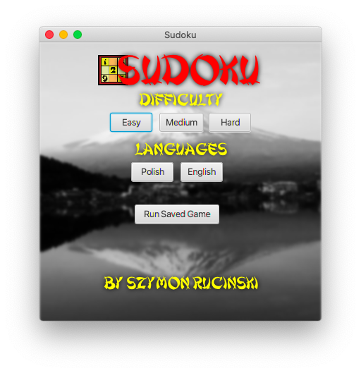
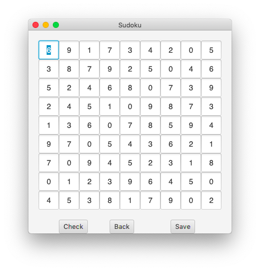

  <p align="center">
    
  </p>
This project is a Sudoku (数独 sūdoku, digit-single) game written in Java. It's gui was developed using JavaFX library.
Sudoku is typical Sudoku puzzle, with nine rows and nine columns that intersect at square spaces. Some of the cells are filled with a number others are blank cells to be solved.

<p align="center">
  
  
</p>

## Getting Started

Simply download this repository and compile Game in order to run it.
Game had been created as project for component programming by Szymon Ruciński an Information Technology student.
This is my first ever game/program with a Graphical User interface.


## Installing

Simply copy these commands in order to clone repository.

```
$ git clone https://github.com/szymonrucinski/Sudoku.git
```


## How to play?

Download latest release for Mac or Windows from [release page](https://github.com/szymonrucinski/Sudoku/releases).

| Windows 	|  [v.1.0-win](https://github.com/szymonrucinski/Sudoku/releases/download/v.1.0-win/Sudoku-1.0-win.zip) 	| run Sudoku.bat 	|
|---------	|---	|---	|
| MacOs   	| [v.1.0-win](https://github.com/szymonrucinski/Sudoku/releases/download/v.1.0-mac/Sudoku-v1.0-mac.zip) 	| run Sudoku.sh 	|


## Built With

* [Maven](https://maven.apache.org/) - Dependency Management
* [JavaFX](https://openjfx.io/) - GUI Library


## Authors

* **Szymon Ruciński** - *Whole work* - [Szymon Ruciński](https://github.com/szymonrucinski)


